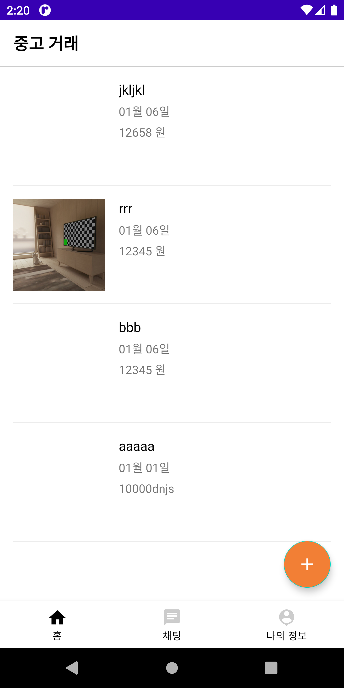
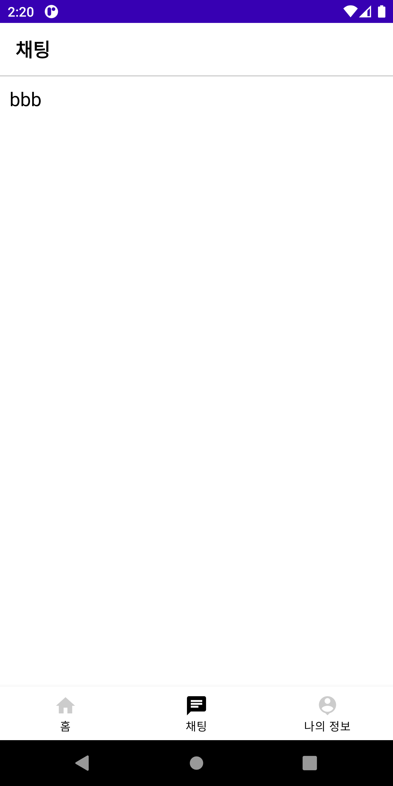
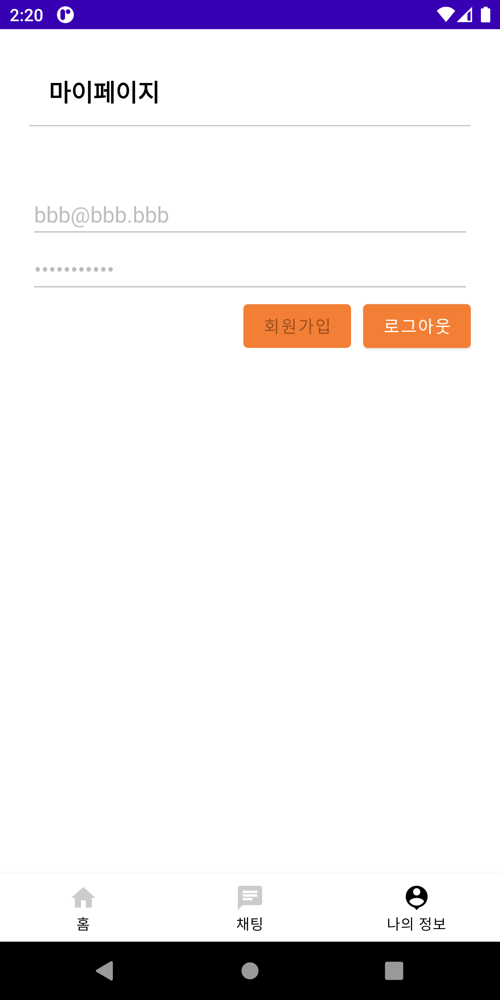
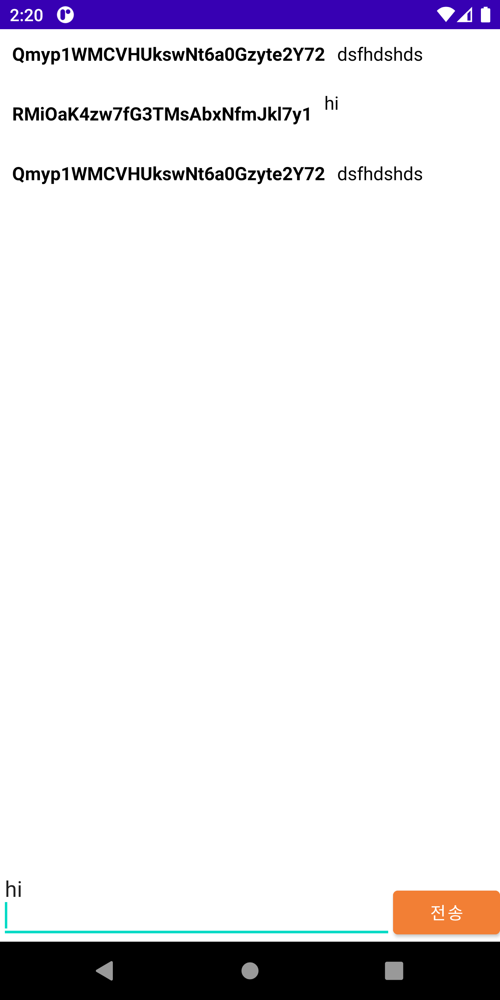

# Android Clone Coding Project #14 중고거래앱
Firebase Authentication 기능을 사용하여 로그인 회원가입 기능을 구현할 수 있음.
 
회원 기반으로 중고거래 아이템을 등록할 수 있음.
 
아이템 등록 시 사진 업로드를 위해 Firebase Storage 를 사용할 수 있음.
 
회원 기반으로 채팅 화면을 구현할 수 있음.
 
Fragment 를 사용하여 하단 탭 화면 구조를 구현할 수 있음.
 
FloatingActionButton 을 사용하기
 

# 결과화면
|Screenshot1|Screenshot2|
|---|---|
|||
|||

 

# 배운 내용 정리
- RecyclerView 사용하기
- View Binding 사용하기
- Fragment 사용하기
- BottomNavigationView 사용하기
- Firebase Storage 사용하기
- Firebase Realtime Database 사용하기
- Firebase Authentication 사용하기

